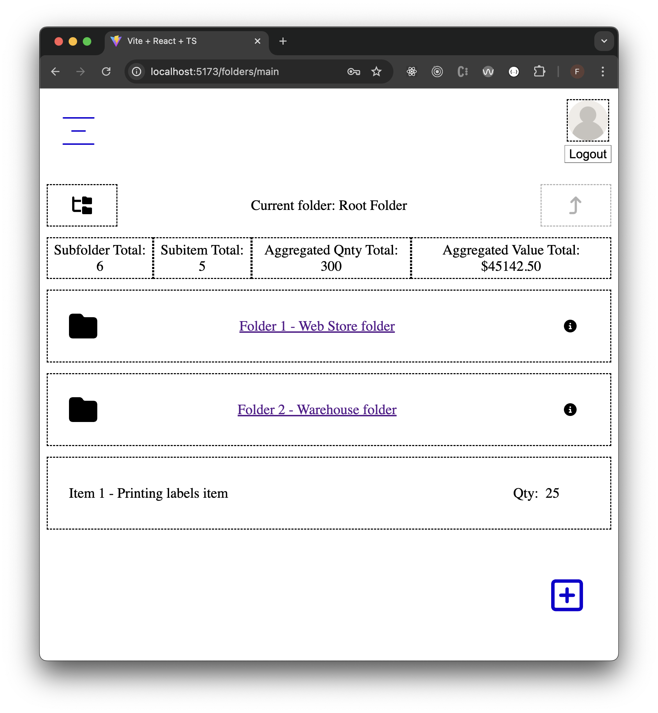
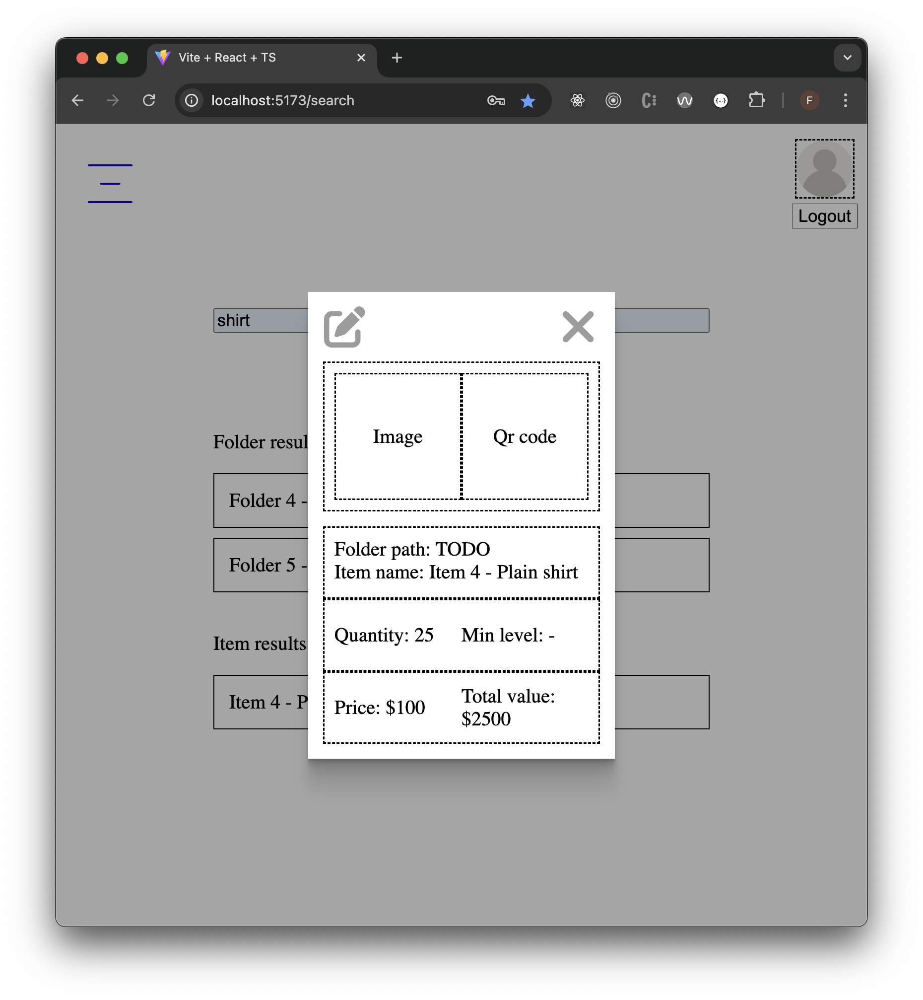

# Description

An app that organizes and manages items in a hierarchical folder structure, while also providing analytics.<br/>
Supports role based login functionality.<br/>


** Currently under development. **

<br/>

This project works together with the following repositories:
- Backend - https://github.com/fceja/inventory_api
- Database - https://github.com/fceja/inventory_db

<br/>

## Installation

1. Install Node
   - ```
     https://nodejs.org/en/download
     ```
2. Clone repo
3. Install project dependencies, at project root run:
   - ```
     npm install
     ```
4. Init React development server:
   - ```
     npm run dev
     ```
   - App served on `http://localhost:5173/`

<br/>

## Technologies & Tools
<p>
  <a
    href="https://www.typescriptlang.org/"
    target="_blank"
    rel="noreferrer"
    style="text-decoration:none"
  >
    </a>
  <a href="https://react.dev/" target="_blank" rel="noreferrer" style="text-decoration:none">
    </a>
  <a href="https://redux.js.org/" target="_blank" rel="noreferrer">
    </a>
  <a href="https://www.w3.org/html/" target="_blank" rel="noreferrer">
    </a>
  <a href="https://sass-lang.com" target="_blank" rel="noreferrer">
    </a>
</p>

## Sample Video / Screenshots

1. Sample Video
   - [Watch on Wave.video](https://watch.wave.video/DZ5XLdAhAI6OUOyA)

   

3. Screenshot - Main folder content page
   
      

4. Screenshot - Search results page
   
      
   
